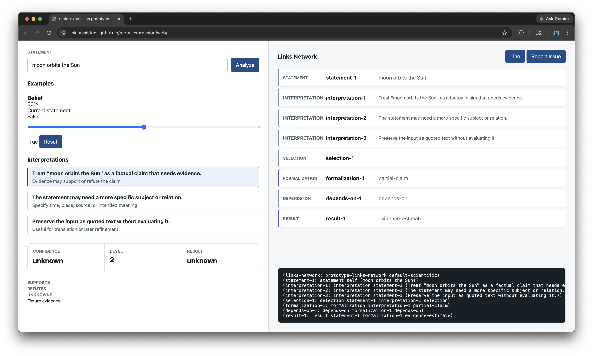

# Case Study: Meta-Expression Adapter API

**Issue:** [#24 - Expose a stable meta-expression adapter for formalization and evaluation](https://github.com/link-foundation/relative-meta-logic/issues/24)

## Executive Summary

Issue #24 asks Relative Meta-Logic (RML) to become a reusable library dependency for `link-assistant/meta-expression`. The needed boundary is not a general natural-language reasoner inside RML. The needed boundary is a stable adapter for cases where another system has already selected an interpretation and can provide explicit dependencies.

This PR adds that boundary in both implementations:

- JavaScript: `formalizeSelectedInterpretation(request)` and `evaluateFormalization(formalization)`
- Rust: `formalize_selected_interpretation(request)` and `evaluate_formalization(&formalization)`

The adapter supports executable arithmetic equality, executable arithmetic value questions, and direct LiNo/RML expressions. Unsupported factual claims remain partial with explicit unknowns instead of being forced into a truth value.

## Collected Issue Data

### RML Issue #24

The issue requests a documented library adapter with this consumer shape:

```ts
formalizeSelectedInterpretation({
  text,
  interpretation,
  formalSystem,
});

evaluateFormalization(formalization);
```

It also asks for:

- reusable APIs/functions to be exposed through the library
- computability status
- formalization level
- unknown dependency reporting
- deterministic evaluation when supported
- partial results for non-computable or underspecified expressions
- fixtures for arithmetic equality, arithmetic questions, and unsupported real-world claims

### Upstream Meta-Expression Issue #7

The upstream issue is [link-assistant/meta-expression#7](https://github.com/link-assistant/meta-expression/issues/7). It focuses on the expression `moon orbits the Sun`, which requires real-world evidence, Wikidata/Wikipedia-backed dependencies, explicit interpretation steps, and issue reporting from the browser UI.

The screenshot from that issue is stored at:



Observed from the screenshot:

- The selected statement is `moon orbits the Sun`.
- The UI lists multiple interpretations, including a factual claim that needs evidence and a "preserve as quoted text" interpretation.
- The formalization is shown as `partial-claim`.
- The result is `unknown`.
- The links output already has nodes for statement, interpretation, selection, formalization, dependencies, and result.

This supports the adapter design: RML should accept the selected interpretation and dependencies, but should not fabricate missing entity/relation resolution or evidence.

## Requirements

| # | Requirement | Implementation |
|---|-------------|----------------|
| R1 | Expose reusable APIs/functions through the library | JS now exports parser/evaluator helpers such as `parseLino`, `keyOf`, `isNum`, `parseBinding`, `parseBindings`, `substitute`, and the adapter functions. Rust already exposed most helpers; `Aggregator::apply` and `Aggregator::from_name` are now public, and the adapter structs/functions are public. |
| R2 | Provide a documented adapter accepting selected interpretation and dependencies | Added JS/Rust README examples and architecture docs. |
| R3 | Return computability, formalization level, unknowns, and deterministic results | Formalization objects include `computable`, `formalizationLevel`/`formalization_level`, `unknowns`, `valueKind`, `ast`, and `lino`; evaluations return a deterministic result object or enum. |
| R4 | Keep unsupported or underspecified expressions partial | Real-world claims return `computable: false` with unknowns such as `selected-subject`, `selected-relation`, `evidence-source`, and `formal-shape`. |
| R5 | Include fixtures for arithmetic equality, arithmetic questions, and unsupported real-world claims | See [fixtures.json](./fixtures.json), plus automated JS and Rust tests. |
| R6 | Preserve deterministic arithmetic behavior | Arithmetic questions are evaluated as expressions, not RML queries, so `0.1 + 0.2` returns `0.3` without query clamping. |
| R7 | Search online for related components/libraries | See "Existing Components and Libraries". |
| R8 | Avoid replacing meta-expression's natural-language and evidence pipeline | RML only handles explicit formal shapes; Wikidata/Wikipedia resolution remains outside this adapter. |

## Formalization Levels

| Level | Meaning |
|-------|---------|
| 0 | No usable formalization was supplied. |
| 1 | A formalization was attempted but the shape is unsupported. |
| 2 | A selected interpretation exists, but dependencies or the formal shape are missing. |
| 3 | The formal shape is executable by RML and can be evaluated deterministically. |

## Adapter Behavior

### Arithmetic Equality

Input:

```js
formalizeSelectedInterpretation({
  text: '0.1 + 0.2 = 0.3',
  interpretation: {
    kind: 'arithmetic-equality',
    expression: '0.1 + 0.2 = 0.3',
  },
  formalSystem: 'rml-arithmetic',
});
```

Result:

- `computable: true`
- `formalizationLevel: 3`
- `unknowns: []`
- evaluation result: truth value `1`

### Arithmetic Question

Input:

```js
formalizeSelectedInterpretation({
  text: 'What is 0.1 + 0.2?',
  interpretation: {
    kind: 'arithmetic-question',
    expression: '0.1 + 0.2',
  },
  formalSystem: 'rml-arithmetic',
});
```

Result:

- `computable: true`
- `formalizationLevel: 3`
- evaluation result: number `0.3`

### Unsupported Real-World Claim

Input:

```js
formalizeSelectedInterpretation({
  text: 'moon orbits the Sun',
  interpretation: {
    kind: 'real-world-claim',
    summary: 'Treat "moon orbits the Sun" as a factual claim that needs evidence.',
  },
  formalSystem: 'rml',
  dependencies: [
    {
      id: 'wikidata',
      status: 'missing',
      description: 'No selected entity and relation ids were provided.',
    },
  ],
});
```

Result:

- `computable: false`
- `formalizationLevel: 2`
- unknowns include selected subject, selected relation, evidence source, formal shape, and missing Wikidata dependency
- evaluation result remains partial and unknown

## Existing Components and Libraries

| Component | What it provides | Relevance to RML |
|-----------|------------------|------------------|
| [math.js expression parsing](https://mathjs.org/docs/expressions/parsing.html) | Parses, compiles, and evaluates math expressions with scopes. | Useful comparison for arithmetic expression APIs, but RML keeps its current dependency-light evaluator. |
| [expr-eval](https://github.com/silentmatt/expr-eval) | A JavaScript mathematical expression parser/evaluator that avoids JavaScript `eval`. | Similar arithmetic-only scope to the local slice meta-expression wants to migrate away from. |
| [JsonLogic](https://jsonlogic.com/) | Portable JSON rule format with implementations across languages. | Good model for deterministic, serializable logic, but it is not LiNo/RML and does not handle RML probabilities/types. |
| [Wikidata Query Service](https://www.wikidata.org/wiki/Wikidata:SPARQL_query_service) | SPARQL endpoint and query service for Wikidata. | Candidate external dependency for meta-expression factual evidence; outside RML adapter scope. |
| [MediaWiki Action API](https://www.mediawiki.org/wiki/API:Main_page) | HTTP API for wiki data and pages. | Candidate source layer for Wikipedia/Wikidata-backed evidence. |
| [wasm-bindgen](https://rustwasm.github.io/docs/wasm-bindgen/) | Rust and WebAssembly bindings for JavaScript interoperability. | Relevant to future Rust/WASM integration requested upstream, but not required for this minimal library API. |
| [Serde](https://docs.rs/crate/serde/latest) | Rust serialization/deserialization framework. | Useful future option if the Rust adapter needs JSON/WASM boundary types; avoided here to preserve current dependency footprint. |

## Solution Plan by Requirement

| Requirement | Plan | Status |
|-------------|------|--------|
| Library adapter | Add a small API layer over the evaluator rather than changing RML semantics. | Done |
| Arithmetic equality | Normalize explicit arithmetic equality into an RML infix equality AST and evaluate with decimal rounding. | Done |
| Arithmetic questions | Evaluate arithmetic ASTs directly instead of wrapping them as `(? ...)` queries, avoiding range clamping. | Done |
| Unsupported real-world claims | Return level-2 partial formalization with explicit unknowns and dependencies. | Done |
| Public reusable helpers | Export JS helper functions and make Rust aggregator lookup/application public. | Done |
| Documentation | Update JS/Rust READMEs and architecture docs; add this case study. | Done |
| Fixtures and tests | Add `fixtures.json` and automated tests in JS and Rust. | Done |
| Future real-world evidence | Keep Wikidata/Wikipedia lookup outside this PR; document it as a consumer dependency. | Deferred |

## Acceptance Checklist

| Requirement | Status |
|-------------|--------|
| Reads issue #24 and upstream meta-expression #7 | Done |
| Downloads and analyzes the screenshot | Done |
| Adds `docs/case-studies/issue-24` | Done |
| Lists requirements and solution plans | Done |
| Searches online for related components | Done |
| Exposes reusable library APIs | Done |
| Adds adapter API in JavaScript and Rust | Done |
| Adds fixtures and tests | Done |
| Keeps unsupported factual claims partial | Done |
